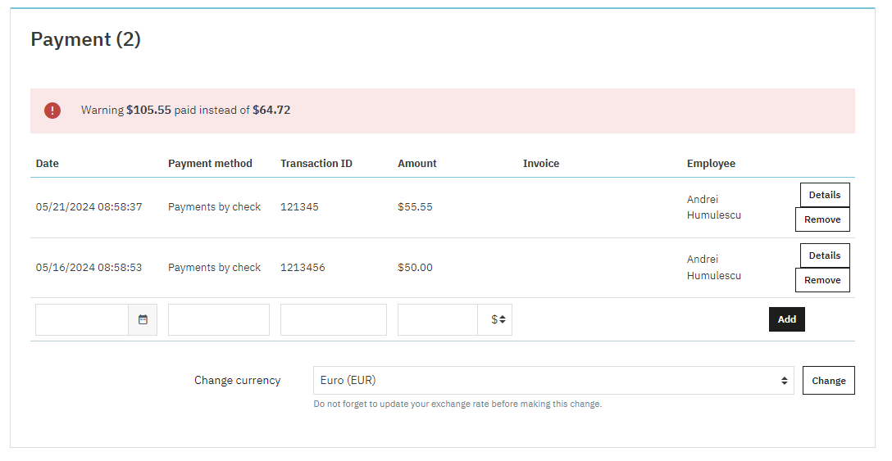

# PrestaShop remove order payment

## Description
PrestaShop module that enables removing order payments \
Tested with PrestaShop 8 and PHP 8.1

## Install
This installs as a standard PrestaShop module. You can get the latest version from [Releases][1] \
Upload the archive to Admin -> Module Manager

## Usage
Once the module has been successfully installed, a 'Remove' button will be displayed for each order payment as shown below \

If you click on the 'Remove' button, a confirn popup will be displayed. \
Once the action has been confirmed, a request for deleting the payment will be sent. \
Based on the outcome of the request, another popup message will be displayed. \
If the payment was deleted, once the popup is confirmed, the page will be refreshed. At this point, the payment should not be displayed under the 'Payment' tab anymore.

## Contributing

PrestaShop modules are open source extensions to the PrestaShop e-commerce solution. Everyone is welcome and even encouraged to contribute with their own improvements.

### Requirements

Contributors **must** follow the following rules:

* **Make your Pull Request on the "dev" branch**, NOT the "master" branch.
* Do not update the module's version number.
* Follow [the coding standards][2].

### Process in details

Contributors wishing to edit a module's files should follow the following process:

1. Create your GitHub account, if you do not have one already.
2. Fork this project to your GitHub account.
3. Clone your fork to your local machine in the ```/modules``` directory of your PrestaShop installation.
4. Create a branch in your local clone of the module for your changes.
5. Change the files in your branch. Be sure to follow the [coding standards][2]!
6. Push your changed branch to your fork in your GitHub account.
7. Create a pull request for your changes **on the _'dev'_ branch** of the module's project. Be sure to follow the [contribution guidelines][3] in your pull request. If you need help to make a pull request, read the [GitHub help page about creating pull requests][4].
8. Wait for one of the core developers either to include your change in the codebase, or to comment on possible improvements you should make to your code.

That's it: you have contributed to this open source project! Congratulations!

## License

This module is released under the [MIT License][MIT] 

[1]: https://github.com/andreihumulescu/ps-remove-order-payment/releases
[2]: https://devdocs.prestashop.com/8/development/coding-standards/
[3]: https://devdocs.prestashop.com/8/contribute/contribution-guidelines/
[4]: https://help.github.com/articles/using-pull-requests
[MIT]: https://opensource.org/license/mit